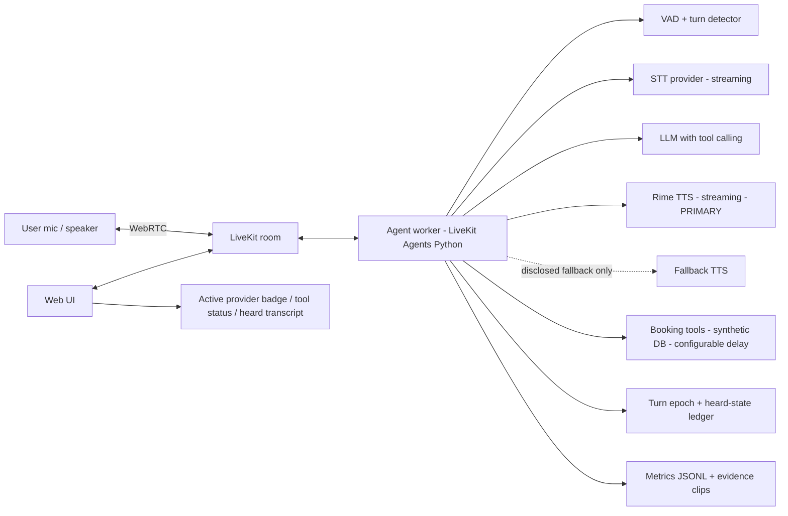

# DataForge x Rime Hackathon — Work Plan

Source brief: [Rime Hackathon Challenge PDF](https://drive.google.com/file/d/11ESipVAAFCH4zseBvpfbpGNchFJmmDNz/view) (6 pages).

> **Status (2026-09-07):** Phases 0–6 are implemented as **ForgeDesk** — see [README.md](README.md),
> [RIME_EVIDENCE.md](RIME_EVIDENCE.md), [docs/DEMO_SCRIPT.md](docs/DEMO_SCRIPT.md). Verified against the live
> Rime API: preflight passes, all seven acceptance scenarios pass with `modelId=coda`/`astra`/`en` over ws3,
> and the evidence + pronunciation artifacts are generated. Remaining human step: **record the demo**.

---

## 1. What is being asked (TL;DR)

- Build a **working product or prototype** for a **specific user and situation**.
- **Rime-generated speech must be essential.** "A chatbot with a play button is not enough." If removing speech leaves the product mostly intact, voice isn't doing enough.
- **Pick ONE hard voice problem**, define its **acceptance test before the demo**, and prove the product handles it under real conditions.
- Any STT / LLM / orchestration / transport stack is allowed, but **Rime must provide the primary spoken output**.
- A focused product with one convincingly solved voice problem beats a broad assistant with many shallow features.

## 2. Judging rubric

| Weight | Criterion | What they look for |
|---|---|---|
| 25% | Problem & necessity of voice | Clear user + problem. Removing speech makes the product materially worse. |
| 25% | Hard voice engineering | A real voice-specific challenge solved under realistic conditions (latency, interruption, pronunciation, multilingual, telephony, delivery consistency, evaluation). |
| 20% | Rime integration & voice experience | Rime is central. Model / voice / language / endpoint / audio format / transport fit the situation; output is clear and appropriate. |
| 20% | Evidence & reproducibility | Claims backed by transparent method, committed artifacts, or a repeatable test measuring **user-visible** behavior. |
| 10% | Demo clarity | User, problem, working product, Rime's role, stress case, and result are easy to understand. |

## 3. Deliverables checklist

- [ ] **Demo video** (max 4–5 min) showing: target user + problem → normal end-to-end flow → the hard voice problem → one deliberate stress/failure case → the result/measurement → which speech provider is active.
- [ ] **Source repository** judges can inspect. Demonstrated behavior must exist in the repo (judges may ask us to reproduce).
- [ ] **README.md** with: setup instructions, architecture, third-party services, known limitations, failure behavior, and the **exact Rime model ID, speaker, language, endpoint, audio format, and transport** used.
- [ ] **RIME_EVIDENCE.md** with: hard voice claim, acceptance test, procedure, result, limitations, and a **repeatable command/script/fixture**.
- [ ] **`.env.example`** with placeholders only.
- [ ] Pass the **organizer-provided Rime configuration + secret preflight check**.

## 4. Disqualifiers (must avoid)

- No verifiable Rime integration in the code.
- Rime used only for welcome message / final confirmation / optional playback / incidental speech.
- Static screens, concept deck, or scripted mock with no working product path.
- Missing demo.
- **Any exposed live credential** (in code, docs, screenshots, or recordings).
- Model/voice/language combination that fails the event preflight and isn't corrected before deadline.
- Unverified performance numbers get **zero credit**. Cached vs uncached must be labelled separately.

## 5. Choosing the hard voice problem

The brief lists these directions (not separate tracks — pick one, or another equally hard problem):

| # | Direction | Fit for us | Risk |
|---|---|---|---|
| 1 | Perceived response time (end-of-turn → first audio) | Measurable, but everyone will do it; hard to stand out | Medium — depends heavily on network to providers |
| 2 | **Interruption and recovery** (stop TTS + playback, fence stale model/tool results, keep state consistent with what user heard) | **Brief literally gives the acceptance test recipe** ("Full-duplex test example") | Medium — real engineering, but well-scoped |
| 3 | **Conversation continuity during tool work** (stay responsive during slow lookups; user can add constraints / cancel; no stale results applied) | Pairs naturally with #2 — same machinery | Medium |
| 4 | Pronunciation & controlled delivery (names, numbers, codes, addresses; before/after clips) | Lowest engineering risk, clean evidence story | Low — but may look "shallow" if it's the only thing |
| 5 | Multilingual / code-switched speech | India-relevant (Hinglish), strong story | **High** — must first verify Rime's live catalog actually supports the target language well |
| 6 | Telephony & adverse audio | Strong differentiation | High — Twilio/SIP setup, cost, extra infra, must test real phone path |
| 7 | Expressive & persistent voice identity | Good for games/coaching | Subjective, harder to measure |
| 8 | Evaluation & observability / benchmark | Useful to community | Strict benchmark rules (≥2 competitor TTS, blinding, item-level results) — heavy |

### Recommendation: **#2 + #3 combined — a full-duplex agent that survives interruption during tool work**

Why:
- The brief hands us the acceptance test ("introduce a fixed delay into a tool call; interrupt while agent is speaking/waiting; change one part of the request; verify…"). Judges already know what "pass" looks like.
- Scores directly on "hard voice engineering" (25%) and "evidence" (20%) with objectively measurable outcomes.
- Voice is obviously essential: the whole point is a hands-busy user talking over a machine that's mid-sentence or mid-lookup.
- LiveKit Agents (recommended by the brief) gives us VAD, turn detection, and basic barge-in out of the box, so we spend our effort on the *hard* part: fencing, cancellation, and heard-state consistency.

### Product skin (pick one; same engine)

Primary proposal: **Voice front-desk / booking agent** (clinic, salon, service center — **synthetic data only**).
- User: someone booking/rescheduling while driving, cooking, or otherwise hands-busy — or a phone-first customer.
- Tools: check availability (slow lookup), book, reschedule, cancel — each with a configurable artificial delay for the stress test.
- Stress case: agent is reading back slots for Tuesday → user cuts in "no wait, make it Thursday afternoon" → audio must stop, Tuesday lookup must be discarded, Thursday lookup runs, final speech reflects Thursday.

Alternatives with identical machinery: warehouse/field-technician parts lookup, hands-free lab/kitchen assistant, customer-support order-status agent.

> Before locking the skin: review the **Voice AI with Rime project catalog** (linked in the PDF) and make sure we're extending, not reproducing.

### Fallback direction if #2/#3 proves too heavy
Direction #4 (pronunciation & controlled delivery) on the same booking agent — names, dates, times, confirmation codes — with fixture-driven before/after clips. Can also be layered onto the primary as a secondary polish item (see Phase 5).

## 6. Proposed architecture



Core components we own (the "hard" part):

1. **Turn epoch / fencing** — every user turn increments an epoch. LLM streams, tool calls, and TTS chunks are tagged with the epoch they belong to. Anything arriving with a stale epoch is dropped and logged, never spoken, never written to state.
2. **Interruption handler** — on barge-in: cancel the Rime stream, flush local playback buffer, record the exact text that was actually played (playout position → text alignment), mark the turn as interrupted.
3. **Tool cancellation & reconciliation** — in-flight tool tasks are `asyncio`-cancelled (or, if non-cancellable, their results are fenced). State mutations (bookings) only commit if the epoch is still current.
4. **Heard-state ledger** — the LLM's context is updated with what the user *actually heard* ("You were interrupted after saying: '…Tuesday at 3 PM and…'") so the follow-up response is grounded in reality, not in the full unspoken sentence.
5. **Observability** — per-turn metrics: interrupt→audio-stop latency, end-of-turn→first-audio latency (warm/cold labelled), stale-result drops, active TTS provider. Written to `evidence/runs/*.jsonl`.
6. **Visible provider status** — UI badge + log line showing `tts_provider=rime` (or `fallback` if it ever switches). Rime is always the default path in the judged flow.

Rime configuration (fill from the **live catalog at submission time**, then test that exact combo):

| Field | Value |
|---|---|
| Model ID | TBD — pick from live catalog (candidates: latest Arcana vs Mist-family; trade naturalness vs latency) |
| Speaker | TBD — pick one voice, keep it constant across all turns and all evidence clips |
| Language | TBD (English first; only add another if catalog + testing confirm quality) |
| Endpoint / region | TBD — closest regional endpoint; document it |
| Audio format | TBD — streaming PCM for WebRTC path |
| Transport | Streaming via official LiveKit Rime integration |

## 7. Acceptance test (write this BEFORE building the demo)

**Claim:** While the agent is speaking or waiting on a slow tool, a user interruption that changes the request results in (a) queued Rime audio stopping promptly, (b) the stale tool result never being spoken or applied, (c) background work cancelled/reconciled, and (d) a final spoken response that reflects what the user actually heard and requested.

**Fixtures**
- Tool delay injected via env/config (e.g. `TOOL_DELAY_MS=3000`).
- Pre-recorded interruption audio clips (WAV) with fixed injection offsets, so runs are repeatable and not dependent on a human's timing.
- Synthetic booking dataset (no real PII).

**Procedure (per run)**
1. Start agent with fixed delay; start a scripted client that plays "Book me a slot on Tuesday afternoon."
2. Wait until agent begins speaking OR tool is in-flight (both variants tested).
3. Inject interruption clip: "Actually, make it Thursday afternoon."
4. Capture: timestamp of interruption detection, timestamp audio playback actually stopped, all text chunks that reached the speaker, tool results received + their epoch, final spoken transcript, final booking state.

**Metrics & pass criteria (targets — tune after baseline)**

| Metric | Target |
|---|---|
| Interrupt detected → audio playback stopped | ≤ ~300 ms p95 over N ≥ 20 runs |
| Stale tool results spoken as current | 0 / N |
| Stale results written to booking state | 0 / N |
| Final response matches updated request (Thursday, not Tuesday) | N / N |
| Heard-ledger contains only text actually played | N / N (verified against playout log) |
| Baseline normal path: end-of-turn → first audio (warm vs cold, labelled) | report, no gate |

**Output:** `evidence/` folder with JSONL results, summary table, and saved audio clips; single command (e.g. `make evidence` or `python -m eval.run_interruption --runs 20`) regenerates everything. This becomes `RIME_EVIDENCE.md`.

## 8. Work phases

### Phase 0 — Setup & decisions
- [ ] Get Rime API key (server-side only), plus STT + LLM provider keys; set budget.
- [ ] Run organizer preflight; pull **live** model/voice/language catalog; pick and test the exact combo.
- [ ] Review Rime project catalog → confirm our skin isn't a close reproduction.
- [ ] Lock product skin, user persona, and the one-sentence problem statement.
- [ ] Write the acceptance test (Section 7) into `RIME_EVIDENCE.md` as a draft — before any demo work.
- [ ] Repo skeleton, `.env.example`, `.gitignore` (secrets never committed), pre-commit secret scan.

### Phase 1 — Baseline voice loop
- [ ] LiveKit Agents worker: VAD → STT → LLM → Rime TTS (streaming) via official plugin.
- [ ] Minimal web UI (LiveKit starter) with mic, transcript, and **active TTS provider badge**.
- [ ] Log end-of-turn → first-audio latency per turn (warm/cold labelled).
- [ ] Smoke test: full conversation works end-to-end with Rime as the only speaker.

### Phase 2 — Tool layer
- [ ] Synthetic booking DB + tools: `check_availability`, `book`, `reschedule`, `cancel`.
- [ ] Configurable artificial delay on tools (`TOOL_DELAY_MS`).
- [ ] "Still looking…" progress speech while tools run (continuity during tool work).
- [ ] Tool status shown in UI.

### Phase 3 — The hard problem
- [ ] Turn epoch tagging across LLM stream, tool tasks, TTS chunks.
- [ ] Barge-in handler: cancel Rime stream + flush playout; measure stop latency.
- [ ] Playout-position → text alignment to build the heard-state ledger.
- [ ] Tool cancellation + epoch-guarded state commits.
- [ ] Inject heard-state into LLM context on the next turn.
- [ ] Manual test: interrupt mid-speech and mid-tool; confirm no stale speech, correct final answer.

### Phase 4 — Evidence harness
- [ ] Scripted client that plays fixture audio into the room at fixed offsets.
- [ ] Metrics collector → `evidence/runs/*.jsonl` + summary table.
- [ ] Save audio clips of each run (what the user heard).
- [ ] One-command reproduction; run N ≥ 20; fill results into `RIME_EVIDENCE.md`.

### Phase 5 — Voice polish & resilience
- [ ] Apply Rime prompting guide / "Writing for the ear" to the system prompt: short sentences, concise spoken turns.
- [ ] Pronunciation fixtures for dates, times, names, confirmation codes; render ≥2 text variants each (model + voice held constant), save clips, note which wording/punctuation fixed what.
- [ ] Failure behavior: STT/LLM/Rime unavailable → clear spoken/visual message; if a fallback TTS is used, it is **disclosed and visible**.
- [ ] Unsupported input handling (silence, noise, off-topic).

### Phase 6 — Docs, preflight, demo
- [ ] README: setup, architecture, third-party services, limitations, failure behavior, exact Rime model/speaker/language/endpoint/format/transport.
- [ ] Final `RIME_EVIDENCE.md` with real numbers, procedure, limitations.
- [ ] Re-run organizer preflight + secret scan on the final commit.
- [ ] Record demo (script in Section 10). Verify no secrets on screen.

## 9. Proposed repo layout

```
DataForge/
├── PLAN.md                  # this file
├── README.md
├── RIME_EVIDENCE.md
├── .env.example             # placeholders only
├── agent/                   # LiveKit Agents worker
│   ├── main.py
│   ├── turn_epoch.py        # fencing
│   ├── interruption.py      # barge-in + heard ledger
│   ├── tools/               # booking tools + synthetic data + delay injection
│   └── metrics.py
├── web/                     # frontend (provider badge, transcript, tool status)
├── eval/                    # scripted client, fixtures, run scripts
│   └── fixtures/            # interruption WAVs, pronunciation text variants
├── evidence/                # generated: JSONL, summary, clips
└── docs/                    # architecture diagram, demo script
```

## 10. Demo script (target ≤ 4–5 min)

1. **User + problem** — who is hands-busy / phone-first and why text won't do.
2. **Normal flow** — book a slot end-to-end; point at the `rime` provider badge.
3. **The hard problem** — explain interruption + stale-result fencing in one breath.
4. **Stress case (live)** — tool delay on, agent mid-sentence, interrupt and change the day; show audio stop, tool cancel in logs, correct final answer.
5. **Measurement** — show the evidence summary table and one clip; state limitations honestly.
6. **Rime config** — model / speaker / language / endpoint / format / transport on screen.

## 11. Risks & mitigations

| Risk | Mitigation |
|---|---|
| LiveKit's built-in interruption hides or conflicts with our fencing logic | Read plugin source early; hook into speech/turn lifecycle events; if needed, own the TTS stream directly |
| Playout-position → text alignment is imprecise | Use TTS chunk boundaries as granularity; disclose the granularity as a limitation |
| Network variability makes latency numbers noisy | N ≥ 20 runs, report p50/p95, label warm/cold, disclose environment |
| Chosen Rime model/voice fails preflight | Pick from live catalog only; re-run preflight before submission |
| Secret leaks in demo/screenshots | `.env` only, pre-commit scan, blur/verify recording |
| Scope creep into "broad assistant" | One skin, one hard problem, one stress case — everything else is a stretch item |

## 12. Open decisions (need input)

- Team size, roles, and the submission deadline.
- Product skin: clinic / salon / service booking vs. another hands-busy scenario.
- Stack: LiveKit Agents (Python, recommended by brief) vs. an alternative.
- STT and LLM providers (and budget).
- Web only, or also a telephony path (Section 5, #6) as a stretch.
- Whether to attempt a second language — only after checking the live catalog.

## 13. Starter resources named in the brief

Voice AI with Rime project catalog · Writing for the ear (prompting TTS to sound human) · TTS in five minutes · Models · Voices and supported languages · Live model/voice/language catalog · Regional endpoints · Rime prompting guide and drop-in system prompt · LiveKit with Rime · Qwen Audio Agent (optional realtime runtime) · Playback speed controls.

(Hyperlinks are in the original PDF; pull them from there.)
