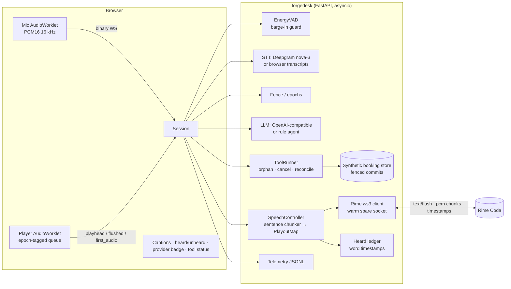

# ForgeDesk — a full-duplex voice front desk that survives being interrupted

**DataForge × Rime Hackathon submission.** ForgeDesk is the phone/voice front desk for a car-service shop
("Forge Auto Care", synthetic data). The caller is usually driving or has their hands under a bonnet, so the
whole interaction is spoken: Rime speaks every word the agent says.

**Hard voice problem we chose and prove:** *interruption and recovery* + *conversation continuity during
tool work*. When the caller talks over the agent — mid-sentence, or while a slow booking-system lookup is
in flight — the agent must (1) stop the audio promptly, (2) know *exactly which words the caller heard*,
(3) make sure a stale lookup result can never be spoken as if it were current, (4) keep or cancel background
work correctly, and (5) reply to the *new* request grounded in what was actually heard. Removing speech
removes the product: the entire difficulty lives in the audio timeline.

**Measured against live Rime Coda, 7 scenarios × 20 runs, 140/140 passed:**

| | |
|---|---|
| Barge-in → playback stopped and queued audio dropped | **15.7 ms p50, 16.5 ms p95, 17.1 ms max** |
| Caller's first mic sample → playback stopped (incl. the 180 ms barge-in guard) | **≤ 184 ms p95** |
| Stale tool results spoken as current | **0 / 140** |
| Audio frames played after a flush | **0 / 140** |
| Heard/unheard resolved from Rime word timestamps | **every interrupted run** |
| Time-to-first-audio (warm p50, from India — ~600 ms of it is Rime TTFB over the Pacific) | 650–760 ms |

Method, per-check breakdown and limitations: [RIME_EVIDENCE.md](RIME_EVIDENCE.md). Audio of what the caller
actually heard before each interruption: [evidence/samples/](evidence/samples/).

---

## Quick start

```bash
make setup                 # venv + deps, copies .env.example -> .env
$EDITOR .env               # set RIME_API_KEY (required). Optional: DEEPGRAM_API_KEY, LLM_API_KEY
make preflight-synth       # live-catalog check + secret scan + one real synthesis over ws3 and HTTP
make run                   # http://127.0.0.1:8080  (use headphones)
```

Zero-key mode: with only `RIME_API_KEY`, ForgeDesk uses the Chrome Web Speech API for recognition and a
built-in deterministic rule agent instead of an LLM. Add `DEEPGRAM_API_KEY` and/or `LLM_API_KEY` to swap in
Deepgram nova-3 and any OpenAI-compatible model (OpenAI, Groq, OpenRouter, Ollama…).

Offline logic check without any keys: `TTS_PROVIDER=fake make run` (badge shows **FAKE — not Rime**) or
`make evidence-offline`.

## The exact Rime configuration used (judged path)

| Field | Value |
|---|---|
| Model ID | `coda` (Rime flagship; word-level timestamps) |
| Speaker | `astra` (English, "Conversational, Customer Support") |
| Language | `en` |
| Endpoint | `wss://users-ws.rime.ai/ws3` (US West). `RIME_WS_BASE=wss://users-east-ws.rime.ai` for US East |
| Audio format | `pcm` (headerless 16-bit LE), `samplingRate=24000`, mono |
| Transport | WebSocket JSON (`/ws3`), `segment=never`, one `flush` per sentence, `contextId` per segment |
| Rime fallback | HTTPS streaming `POST https://users.rime.ai/v1/rime-tts`, `Accept: audio/L16`, same model/speaker/lang |

Why this configuration: Coda over `/ws3` returns **word-level timestamps** alongside the audio; that is what
lets ForgeDesk map "playback stopped at sample N" back to "the caller heard up to the word *Thursday*".
`segment=never` gives us deterministic synthesis boundaries (Rime's recommendation for agents). The
model/speaker/lang combination is validated against the **live catalog** (`/data/voices/all-v2.json`) by
`make preflight` rather than a stale list in code. `GET /config` on the running server returns this
configuration.

**Hard stop is a socket drop, not a close handshake.** Rime's `clear` operation does not cancel an
in-flight synthesis, so the connection has to go. But `close()` waits for the server's close frame, and
mid-stream the server keeps sending: awaiting it made barge-in → audio-stop take **10,001 ms** in the first
live run. ForgeDesk detaches the socket, closes it in the background and continues on a pre-warmed spare,
which brought the same measurement to **~15 ms**. Idle ws3 sockets are also dropped server-side within a few
seconds, so connections are kept warm with 5 s pings, checked (`close_code`, age) before reuse, and a
dropped connection forces a brand-new one instead of retrying an equally stale spare.

### Region choice

Measured from the development machine (India) with the production configuration, 6 warm requests each:

| Endpoint | Warm TTFB p50 | Min | Max |
|---|---|---|---|
| `wss://users-ws.rime.ai` (US West) | **578 ms** | 359 ms | 582 ms |
| `wss://users-east-ws.rime.ai` (US East) | 637 ms | 514 ms | 723 ms |

US West is the default. Almost all of that is trans-Pacific network time (Rime's published Coda model
latency is ~96 ms P50): TLS connect alone measures ~1.1 s from here. Judges running this from a US region
should see substantially lower time-to-first-audio; the numbers in `evidence/` are honest about where they
were taken.

### Fallback behaviour (visible, disclosed)

`rime-ws3` → (two failures) → `rime-http` (same model/speaker) → `unavailable` (captions only, no speech).
Every switch is sent to the client as a `provider` message, changes the badge colour and text, and is logged
in telemetry. There is **no non-Rime speech fallback**. The `fake` engine exists only for offline tests and
is labelled "NOT RIME" everywhere it appears.

## Architecture



### The mechanisms that make full duplex real

1. **Epoch fence** (`forgedesk/fence.py`). Every agent response owns an epoch. A barge-in or a new user
   turn bumps it. LLM tokens, tool results and audio frames all carry their epoch; anything stale is dropped
   and logged (`tool_stale_result_fenced`), never spoken, never committed. The player worklet is a second
   fence: audio frames for a flushed or older epoch are discarded client-side.
2. **Hard stop + heard ledger** (`forgedesk/speech.py`, `forgedesk/ledger.py`). On interruption the server
   sends `flush`, drops the Rime socket, and the client reports the exact number of samples it played. The
   `PlayoutMap` knows which sentence produced which slice of the timeline and, from Rime's timestamps, which
   words. Result: `heard="Let me check Thursday"`, `unheard="afternoon. Still checking."`. That goes into the
   LLM context (and drives the "as I was saying…" resume when the interruption had no words).
3. **Tool continuity** (`forgedesk/tools/runner.py`). Read-only lookups interrupted mid-flight are
   *orphaned*, not killed: "are you still there?" makes the agent `await_pending` and reconcile the result
   into the new epoch; "actually, Thursday" makes it `cancel_pending` and look up Thursday. Mutations that
   have not committed are cancelled, and the store re-checks the fence at commit time. A mutation that did
   commit but whose confirmation was never heard is surfaced first on the next turn ("Quick note, I did book
   Tuesday at 1 PM, code F D, Q Z 2 J") and reconciled (reschedule, not double-book).
4. **Barge-in detection** — server-side energy VAD on the raw mic stream (180 ms minimum speech, adaptive
   noise floor) and/or recogniser interim text (`BARGE_IN_MODE`). The application keeps consuming mic audio
   while Rime is playing and while tools run.
5. **Low first-audio latency** — the sentence chunker releases the first clause early; Rime synthesis is
   serialized per sentence on a warm socket with a pre-opened spare, so a hard stop costs no reconnect.
6. **Writing for the ear** — the system prompt enforces one or two short sentences, one question, a lead-in
   before slow lookups, and confirmation codes rendered letter by letter (`F D, 7 Q 2 K` on Coda,
   `spell(FD7Q2K)` on Mist). `make pronunciation` renders every A/B variant with the model and voice held
   constant and records **the tokens Rime actually spoke** (from its word timestamps), so the choice is
   evidence rather than opinion — see [evidence/PRONUNCIATION.md](evidence/PRONUNCIATION.md).

## Third-party services

| Role | Default | Alternatives | Notes |
|---|---|---|---|
| Text-to-speech | **Rime Coda** (`ws3`) | Rime HTTP (fallback only) | Primary spoken output, judged path |
| Speech recognition | Deepgram nova-3 streaming | Chrome Web Speech API (zero-key) | Barge-in does not depend on STT latency |
| Language model | any OpenAI-compatible chat model | built-in rule agent (zero-key, deterministic) | Rule agent also powers the acceptance tests |
| Transport | FastAPI WebSocket + AudioWorklets | — | No LiveKit/WebRTC needed for the demo |

Credentials live only in `.env` (git-ignored) or the process environment. Never in code, docs, screenshots or
the recording. `make secrets` scans the repo; `make preflight` runs it too.

## Evidence & reproducibility

```bash
make evidence-offline          # logic check, FakeTTS, labelled NOT EVIDENCE
make evidence RUNS=20          # judged: real Rime, 7 scenarios x 20 runs -> evidence/SUMMARY-rime.md
make pronunciation             # A/B clips for codes/times/lead-ins, model+voice constant
make samples                   # curate evidence/samples/ (the audio committed to the repo)
```

Runs are resumable: each completed run lands in `evidence/results/` and the summary is rebuilt after every
one, so a long sweep survives an interruption (`--summarize` rebuilds without running anything).

`eval/scenarios.py` holds the seven acceptance scenarios (interrupt mid-speech, interrupt during a 3 s
lookup, status question during a lookup, baseline, wordless interruption + resume, interrupt during an
uncommitted booking, interrupt after a committed-but-unheard booking). Each run drives the *real* session
code with a simulated client that has a real-time playback clock, injects mic audio so the server VAD fires,
and records JSONL telemetry (`evidence/runs/`), spoken text per epoch, ledger entries, store commits and —
with Rime — the WAV of what the user actually heard (`evidence/clips/`, curated into `evidence/samples/`).
Details and results: [RIME_EVIDENCE.md](RIME_EVIDENCE.md).

Tests (no keys needed): `make test` — fence/ledger/VAD/chunker units, tool-runner semantics, all scenarios
offline, a WebSocket server test that interrupts a live session, and the OpenAI-compatible LLM protocol
against a mocked streaming endpoint.

## Known limitations

- **Heard-state granularity.** Word-level only when Rime returns timestamps (Coda, `en`/`es`). Over HTTP or
  other languages the ledger falls back to a proportional estimate and says so (`method=proportional`).
  A word counts as heard once 60 % of it has played.
- **Stop latency is measured to the client's acknowledgement**, which is an upper bound on when playback
  actually stopped (the flush message arrives one half round-trip earlier).
- **Time-to-first-audio is network-bound from outside the US.** From the development machine (India) warm
  TTFB to Rime is ~400–880 ms, of which Rime's own model latency is ~96 ms P50 per their published
  benchmarks. This is disclosed in the evidence rather than presented as application latency.
- **Long idle gaps.** Rime drops idle ws3 sockets within seconds. Pings and a pre-warmed spare hide this,
  but the very first turn after a long pause can still pay a reconnect; if both the socket and the spare are
  dead, the turn falls back to Rime HTTP (visible in the badge) rather than failing.
- **Echo.** Full duplex with speakers can make the mic hear the agent. The browser path uses `echoCancellation`,
  the VAD needs 180 ms of speech, and headphones are recommended for the demo. Chrome's Web Speech API does its
  own capture without our AEC — prefer Deepgram when demoing on speakers.
- **Turn detection** with browser STT relies on Chrome's endpointing; with Deepgram it uses `speech_final`
  and `UtteranceEnd`. There is no semantic end-of-turn model.
- **Rule agent** covers the booking domain only (book / move / cancel / status / repeat). Use an LLM for
  open-ended conversation; the fencing and ledger are provider-agnostic.
- **Single language** (English) shipped. Rime Coda supports nine; `RIME_LANG`/`RIME_SPEAKER` must be a
  catalog-valid pair and timestamps are `en`/`es` only.
- **Not telephony.** WebSocket/browser transport only; the audio pipeline is 24 kHz PCM, not 8 kHz μ-law.
- **Synthetic data only.** Slots, names and vehicles are generated; nothing is real.

## Failure behaviour

| Failure | What the caller experiences | What the UI/logs show |
|---|---|---|
| Rime ws3 error/timeout | One retry on a fresh socket, then the same sentence over Rime HTTP | badge turns amber "FALLBACK PATH", `provider_changed` event |
| All Rime paths down | Captions only, no speech | badge red "TTS: UNAVAILABLE", `speech_unavailable` events |
| Missing `RIME_API_KEY` | Session refuses to start | `fatal` message with hint in the log |
| STT error | Turn not recognised; typed input still works | `stt_error` event |
| LLM/tool exception | "Sorry, something went wrong on my end. Could you say that again?" | `response_error` event |
| Booking slot taken between offer and book | Error is spoken plainly with an alternative | tool result `error` |
| Unsupported input (noise, cough) | Agent stops, waits 1.4 s, resumes from the first unheard word | `resume_unheard` event |

## Repository layout

```
forgedesk/            application package
  session.py          full-duplex orchestrator (barge-in, epochs, turns, recovery)
  speech.py           SpeechController: sentences -> Rime -> epoch-tagged audio, PlayoutMap
  ledger.py           heard/unheard computation from timestamps or proportional fallback
  fence.py            epochs and stale-work fencing
  tools/              synthetic booking store (fenced commits) + ToolRunner (orphan/cancel/reconcile)
  tts/                rime_ws.py (ws3 JSON), rime_http.py (L16), fake.py (offline), catalog.py (live catalog)
  llm/                openai_compat.py, rules.py (deterministic agent), prompt.py (writing for the ear)
  stt/                deepgram.py, browser.py, scripted base
  transport.py        WebSocket transport + SimulatedClient (real-time playback clock)
  vad.py, textseg.py, telemetry.py, audio.py, config.py, server.py
web/                  browser client (AudioWorklets for mic + epoch-aware player, UI)
eval/                 acceptance scenarios, harness, runner; fixtures for pronunciation A/B
scripts/              preflight (live catalog + secrets + real synth), secret_scan, render_variants
tests/                pytest suite
evidence/             generated summaries, runs (JSONL), clips (WAV)
docs/DEMO_SCRIPT.md   the 4–5 minute demo plan
PLAN.md               original work plan
```

## Demo

See [docs/DEMO_SCRIPT.md](docs/DEMO_SCRIPT.md). Run with `TOOL_DELAY_MS=3000` (or the in-UI selector) for the
stress case. The active speech provider is always on screen in the header badge and in `GET /config`.
